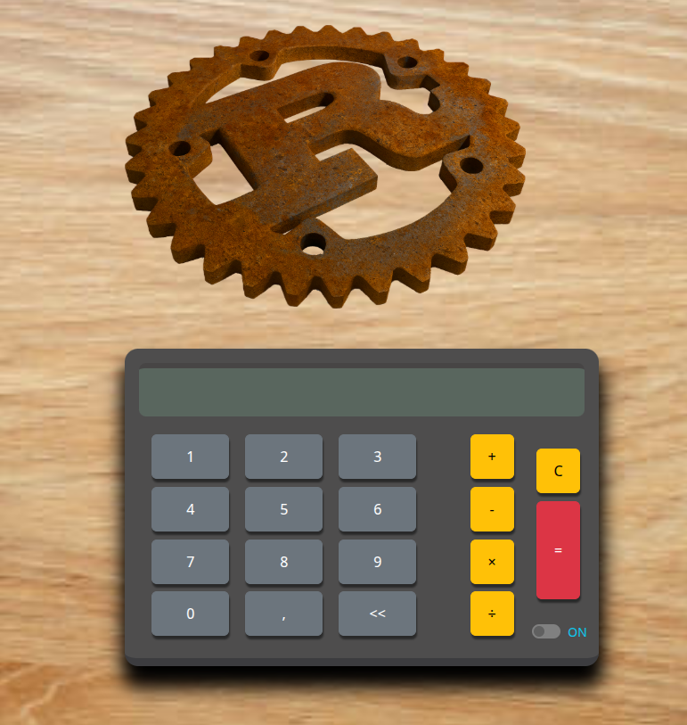

    

<h1 align='center'>Proyecto ACA</h1>

Proyecto de Calculadora la cual fue construída en las siguientes tecnologías:

    
    <b>Rust</b>: Lenguage de programación del Backend  
    
    <b>Actix</b>: Framework de Rust para servidores web  
    
    <b>TypeScript</b>: Lenguage de programación del typescript  
    
    <b>React</b>: Librería de JavaScript para el typescript  
    
    <b>Bootstrap</b>: Framework de CSS para el typescript  

### Despliegue 🌎

El proyecto está desplegado en 2 servidores gratuitos (Render para el backend y Netlify para el frontend), a causa de esto la plataforma inicialmente puede presentar demoras ya que estos servicios se inactivan automáticamente cada 15 minutos de no uso. [Link sitio](https://calculadora-aca.netlify.app/)

>[!NOTE]
> Es necesario iniciar o encender la calculadora para su funcionamiento